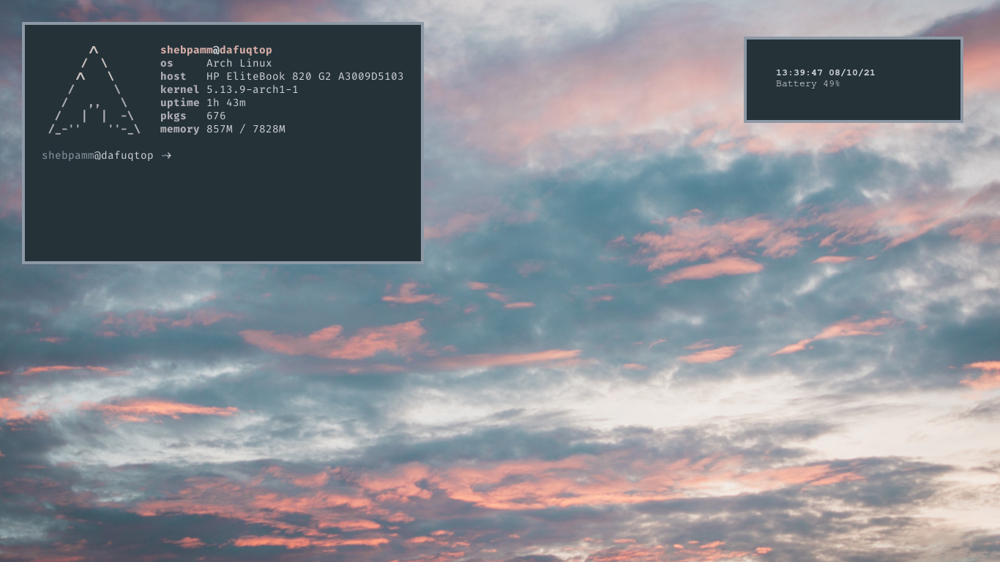
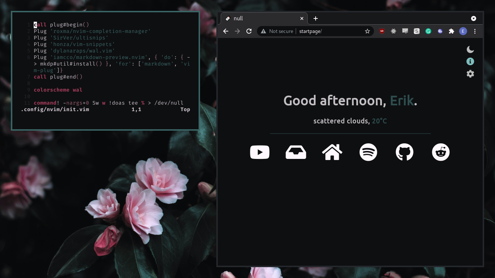
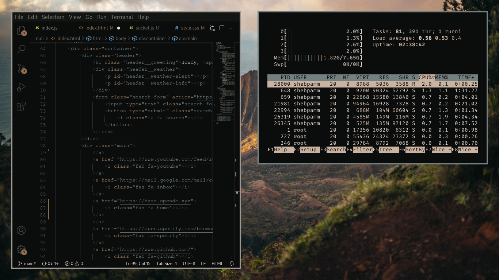
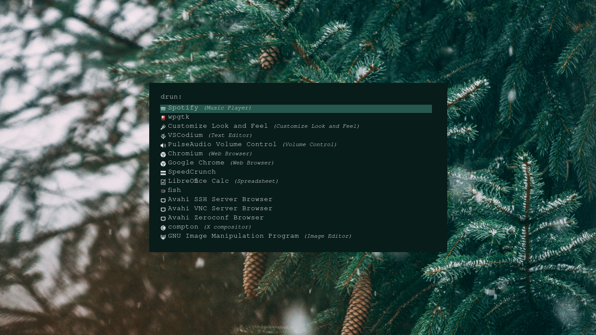

# Dots of mine.

## Info

##### This repository contains dotfiles for my laptop setup.

##### The main premise has been to make everything automatically adapt colors from pywal:

## Programs used:
- **wm:** [herbstluftwm](https://herbstluftwm.org/)
- **colors:** [wpgtk](https://github.com/deviantfero/wpgtk)
- **terminal:** [kitty](https://sw.kovidgoyal.net/kitty/)
- **launcher:** [rofi](https://github.com/davatorium/rofi)
- **icons:** [Suru++ Asprómauros](https://github.com/gusbemacbe/suru-plus-aspromauros)
- **font:** [Fira Code Nerd Font](https://github.com/ryanoasis/nerd-fonts/tree/master/patched-fonts/FiraCode/Regular)
- **notify-daemon:** [dunst](https://dunst-project.org/)
- **shell:** [fish](https://fishshell.com/)
- **startpage:** [null](https://github.com/sadparadiseinhell/null)

